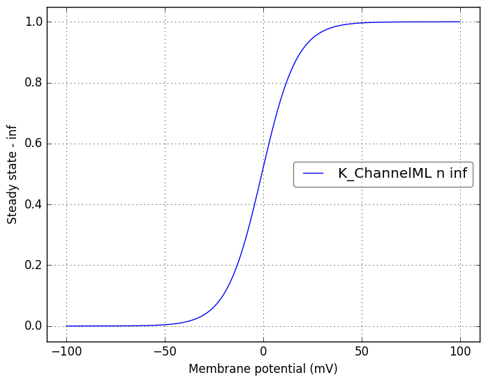

Channel information
===================
    

Channel information at: T = 23.0 degC, E_rev = 0 mV, [Ca2+] = 5e-05 mM

<table>
    <tr>
<td width="120px">
            <b>Na_ChannelML</b> 
            <a href="../Na_ChannelML.channel.nml">Na_ChannelML.channel.nml</a> 
            <b>Ion: na</b> 
            <i>g = gmax * m3 * h </i> 
            Fast Na channel as used in Mainen ZF, Joerges J, Huguenard JR, Sejnowski TJ (1995)
</td>
<td>

</td>
<td>

</td>
</tr>
    <tr>
<td width="120px">
            <b>K_ChannelML</b> 
            <a href="../K_ChannelML.channel.nml">K_ChannelML.channel.nml</a> 
            <b>Ion: k</b> 
            <i>g = gmax * n </i> 
            Noninactivating K channel as used in Mainen et al. 1995
</td>
<td>

</td>
<td>

</td>
</tr>
</table>

